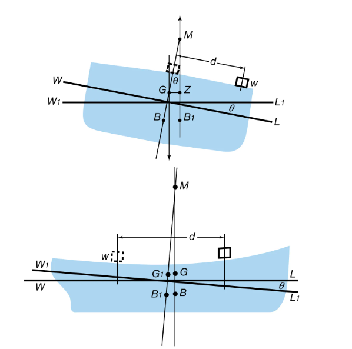

This folder has 

### Aim: 
To determine experimentally the metacentric height of a flat bottomed pontoon.

### THEORY

Buoyancy: When a body is immersed in a fluid either wholly of partially, it is buoyed or lifted up by a force, which is equal to the weight of fluid displaced by the body.

Centre of Buoyancy: The point of application of the force of buoyancy on the body is known as the centre of buoyancy. It is always the centre of gravity of the volume of fluid displaced.

Metacentre: Figure shows a body floating in a liquid in a state of equilibrium. When it is given a small angular displacement, it starts oscillating about some point M. This point, about which the body oscillating, it is called metacentre. 

The metacentre may also be defined as a point of intersection of the axis of body passing through centre of gravity G and original centre of buoyancy B and a vertical line passing through the centre of buoyancy B1 of the tilled position of the body. 

### DESCRIPTION

The experimental set up consists of a pontoon (flat bottomed vessel) which is allowed of float in a M.S. tank having a transparent side. Removable steel strips are placed in the model for the purpose of changing the weight of the vessel. By means of a pendulum (consisting of a weight suspended to a longer pointer), the angle of tilt θ can be measured on a graduated arc. For tilting the ship model a cross bar with two movable hangers is fixed on the model. Pendulum and graduated arc are suitably fixed at the centre of the cross bar.

### PROCEDURE

1.	Note down the relevant dimensions as area of collecting tank, mass density of water etc.
2.	Note down the water level in the tank when pontoon is not in the tank.
3.	Pontoon is allowed to float in the tank. Note down the reading of water level in the tank. Mass of pontoon can be obtained by the help of Archimedes’s principle.
4.	Position of unbalanced mass, weight of unbalanced mass and the angle of heel can be noted down. Calculated the metacentric height of the pontoon.
5.	The procedure is repeated for other positions and value of unbalanced mass.
6.	Also the above procedure is repeated while changing the weight of the pontoon by changing the number of strips in the pontoon.

### DATA

Area of Tank (A) = 2500 cm2 
Unit weight of water (w) = 1 gm/cm3

### RESULTS

The metacentric height of a flat bottom pontoon =

### PRECAUTIONS

1.	Apparatus should be in leveled conditions.
2.	Reading must be taken in steady condition of water.
3.	Unbalanced mass should be measured by taking care that water disturbance should be minimum.
